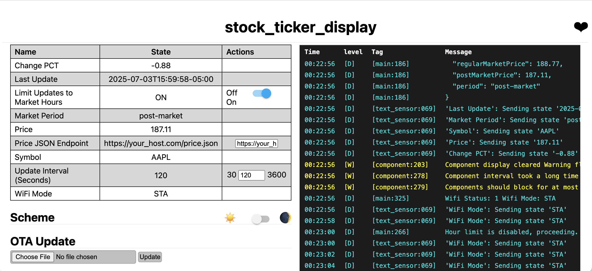

# Stock Ticker Display (ESPHome + ePaper)

This project displays live stock ticker data on a 2.13" ePaper screen using ESPHome and a Lolin C3 Mini board. It connects over WiFi, fetches pricing from a self-hosted user-defined HTTP JSON endpoint, and supports OTA updates, captive portal fallback WiFi configuration, market-hours scheduling, and more.




---

## Hardware

- **Microcontroller**: Lolin C3 Mini (ESP32-C3)
- **Display**: [Waveshare 2.13" ePaper TTGO b74 variant](https://www.amazon.com/dp/B0D22JJ18B)
- **Connections**:

| Function     | Pin        | Color Label |
|--------------|------------|--------------|
| `clk_pin`    | GPIO2      | Yellow       |
| `mosi_pin`   | GPIO4      | Blue         |
| `cs_pin`     | GPIO6      | Orange       |
| `dc_pin`     | GPIO10     | Green        |
| `busy_pin`   | GPIO3      | Purple       |
| `reset_pin`  | GPIO5      | White        |
| `3v`         | 3V         | Grey         |
| `GND`        | GND        | Brown        |

---

## Features

- **Smart market-hours logic**: Only updates when markets are open (inclusive of pre and post-market).
- **WiFi fallback mode**: Auto-starts Access Point + captive portal if no connection is available.
- **User-adjustable fetch interval**: From 30 seconds to 1 hour (default 30 seconds). Only updates display if change occurred.
- **OTA firmware updates** via ESPHome dashboard, command line, or web interface.
- **Local Web UI**: For easy manual control and diagnostics. You can connect via the name.local, eg: `http://stock_ticker_display_main.local`
- **Supports Custom HTTP endpoint** for price data (must return JSON).

---

## Software Overview

This project uses [ESPHome](https://esphome.io) and should be deployed via the ESPHome dashboard or CLI.

### Substitutions

```yaml
substitutions:
  name: stock_ticker_display_main
  clk_pin: GPIO2
  mosi_pin: GPIO4
  cs_pin: GPIO6
  dc_pin: GPIO10
  busy_pin: GPIO3
  reset_pin: GPIO5
```

### JSON Endpoint Format

To display a custom ticker, your JSON endpoint *must* return the below at minimum. Your endpoint can be protected or hosted locally. ESPHome supports SSL (validation disabled by default).

```json
{
  "symbol": "AAPL",
  "timestamp": "2025-07-03T15:59:58-05:00",
  "changePercentage": "-0.88",
  "latestPrice": 196.11,
  "period": "after-hours"

```
Valid Entries for `period`: `['pre-market', 'regular-market', 'after-hours']`

Note: `$` will be prepended to `latestPrice` on display. `%` will be appended to `changePercentage` on display.


---

## Display Modes

- **STA Mode + Connected**: Shows price, symbol, and % change.
- **STA Mode + Connecting**: "WiFi Connecting..." notice with timeout.
- **AP Mode**: Fallback instructions with captive portal address.


---

## Automation & Scripts

### Auto-fetch at boot:
- Waits for WiFi.
- Updates display immediately.

### Interval updates:
- Conditionally runs `fetch_and_update` based on:
  - Market hour window
  - Selected refresh interval
  - WiFi connected status

---

## Secrets.yaml

If building from scratch, the following are required fields:

```yaml
wifi_ssid: "your_home_wifi"
wifi_password: "your_wifi_password"
wifi_ssid_two: "fallback_wifi"
wifi_password_two: "fallback_password"
epaper_price: "https://your-server.com/price-feed.json"
```

---

## Fonts

Includes [Montserrat Black](https://fonts.google.com/specimen/Montserrat) in 3 sizes:
- Price (50pt)
- Ticker (20pt)
- WiFi/Instructions (12pt)

---

## Debugging

- **View Logs** via ESPHome CLI or Web UI.
- Log level: `DEBUG`

---

## Flashing

```bash
esphome run stock_ticker_display.yaml
```

Or upload a compiled binary via the OTA update mechanism on the web interface (you can connect via the name.local, eg: `http://stock_ticker_display_main.local`, or via the captive/WiFi setup interface) after the first flash.